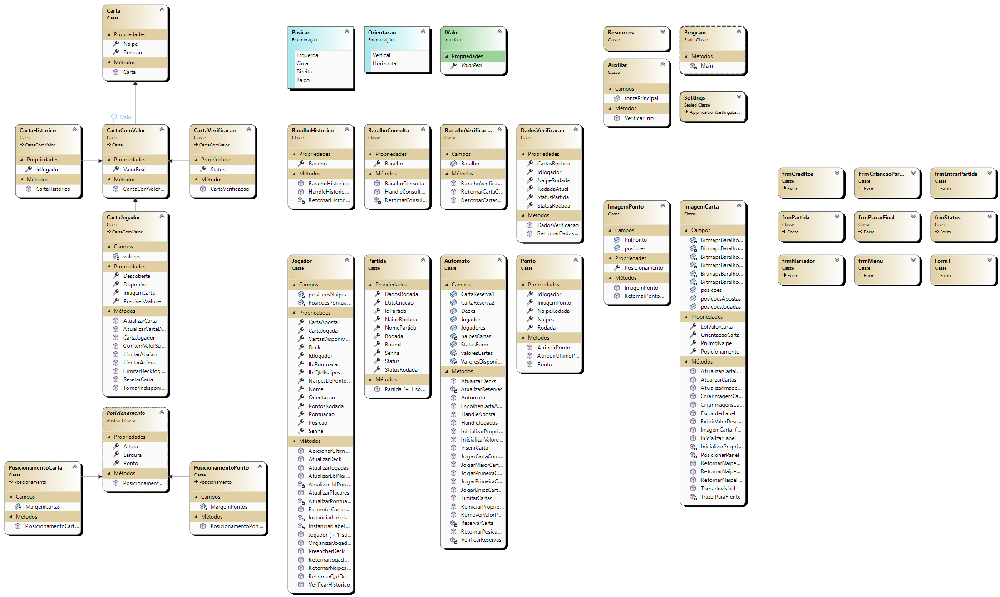
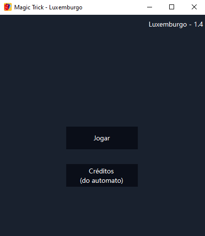
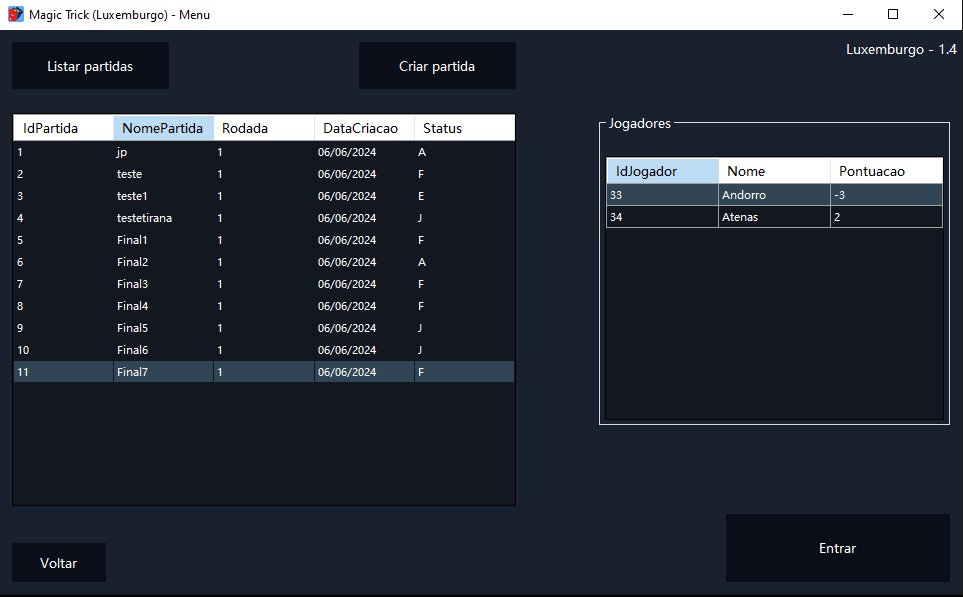
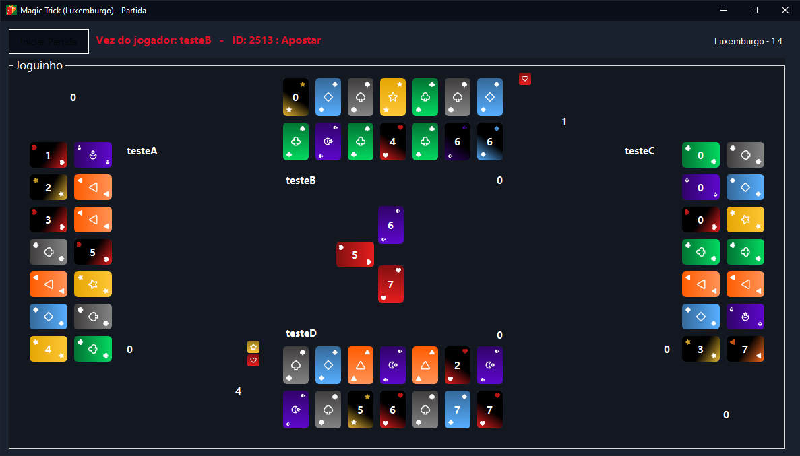
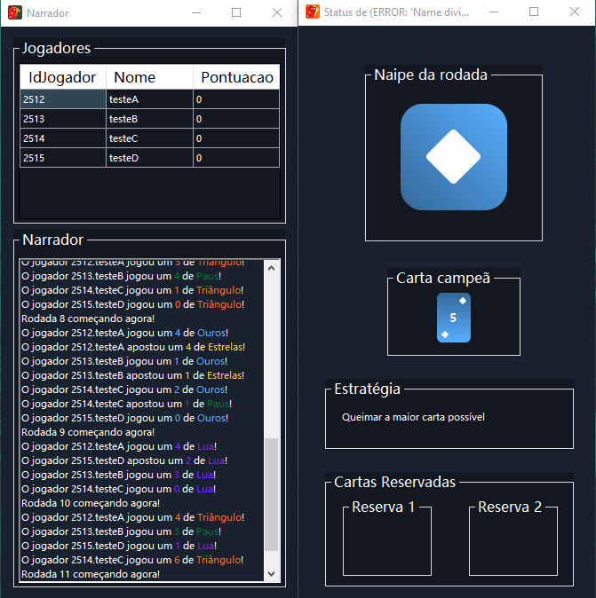

# Pi III - Sistema autônomo: Magic Trick

Este é o repositório do autômato do grupo de Luxemburgo, para o jogo Magic Trick 
Ele foi desenvolvido como projeto integrador do terceiro semestre de ciência da computação. 

O projeto foi desenvolvido utilizando como linguagem o C#, contando com uma DLL feita a mão pelo professor Thiago Ribeiro Claro, que contém métodos que retornam as informações do jogo.

## Diagrama de Classes

## Imagens do projeto

### Tela de início

### Menu

### Tela de partida

### Telas auxiliares

## Sobre o projeto
O desenvolvimento dele levou semestre, em sua conclusão foi realizado um campeonato entre as equipes, e mesmo não tendo terminado como ganhador sinto que não foi um desperdício.
Descobri bugs do servidor, fiz testes, planejei e re planejei o que devia programar a seguir, dediquei finais de semana, os poucos feriados e uma boa parcela do meu tempo livre ao projeto, ganhei experiência com a tecnologia, me envolvi e entreti com o projeto. Foi uma experiência única.
